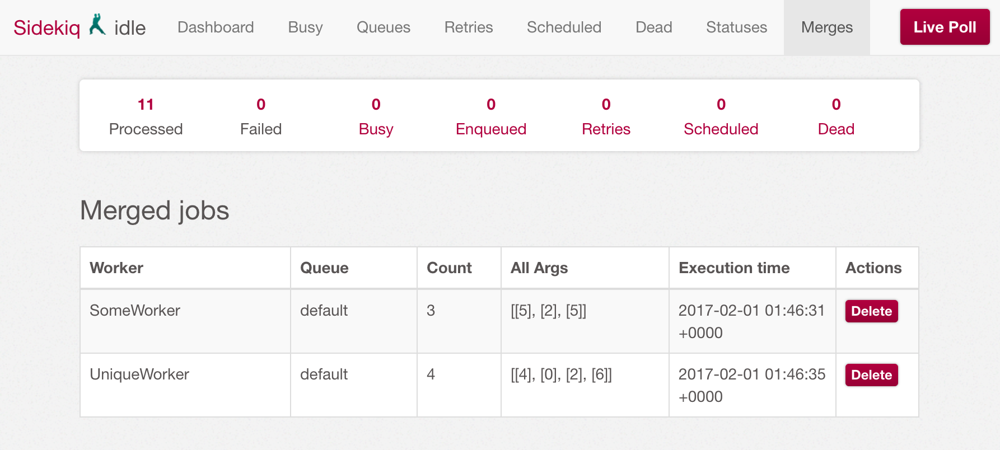

# sidekiq-merger

[![Gem Version][gem-image]][gem-link]
[![Dependency Status][deps-image]][deps-link]
[![Build Status][build-image]][build-link]
[![Coverage Status][cov-image]][cov-link]
[![Code Climate][gpa-image]][gpa-link]

Merge sidekiq jobs occurring before the execution time. Inspired by [sidekiq-grouping](https://github.com/gzigzigzeo/sidekiq-grouping).

## Installation

Add this line to your application's Gemfile:

```ruby
gem 'sidekiq-merger'
```

And then execute:

  $ bundle

Or install it yourself as:

  $ gem install sidekiq-merger

## Usage

Add merger option into your workers.

```ruby
class SomeWorker
  include Sidekiq::Worker

  sidekiq_options merger: { key: -> (args) { args[0] } }

  def perform(*merged_args)
    merged_args.each do |args|
      # Do something
    end
  end
end
```

Then, enqueue jobs by `perform_in` or `perform_at`.

```ruby
SomeWorker.perform_in 100, 4
SomeWorker.perform_in 100, 3
SomeWorker.perform_in 100, 5
# Passed 100 seconds from the first enqueue.
SomeWorker.perform_in 100, 6
SomeWorker.perform_in 100, 1
```

`SomeWorker` will be executed in 100 seconds with args of `[4], [3], [5]`, then with args of `[6], [1]`.

`perform_async` works without merging args.

```ruby
SomeWorker.perform_async 4
SomeWorker.perform_async 3
SomeWorker.perform_async 5
```

In this case, `SomeWorker` will be executed 3 times with args of `[4]`, `[3]` and `[5]`.

## Options

### `key` (optional, default: `nil`)

Defines merge key so different arguments can be merged.

Format: `String` or `Proc`
e.g. `sidekiq_options merger: { key: -> (args) { args[0..1] } }`

### `unique` (optional, default: `false`)

Prevents enqueue of jobs with identical arguments.

Format: `Boolean`
e.g. `true`

## Web UI



Add this line to your `config/routes.rb` to activate web UI:

```ruby
require "sidekiq/merger/web"
```

## Test

  $ bundle exec rspec

The test coverage is available at `./coverage/index.html`.

To check the behavior of this plugin, you can run docker containers.

  $ docker-compose up

Then, open `http://localhost:3000/`.

## Lint

  $ bundle exec rubocop

## Contributing

1. Fork it
2. Create your feature branch (`git checkout -b my-new-feature`)
3. Commit your changes (`git commit -am 'Add some feature'`)
4. Push to the branch (`git push origin my-new-feature`)
5. Create new [Pull Request](../../pull/new/master)

## Copyright

Copyright (c) 2017 dtaniwaki. See [LICENSE](LICENSE) for details.

[gem-image]:   https://badge.fury.io/rb/sidekiq-merger.svg
[gem-link]:    http://badge.fury.io/rb/sidekiq-merger
[build-image]: https://secure.travis-ci.org/dtaniwaki/sidekiq-merger.svg
[build-link]:  http://travis-ci.org/dtaniwaki/sidekiq-merger
[deps-image]:  https://gemnasium.com/dtaniwaki/sidekiq-merger.svg
[deps-link]:   https://gemnasium.com/dtaniwaki/sidekiq-merger
[cov-image]:   https://coveralls.io/repos/dtaniwaki/sidekiq-merger/badge.png
[cov-link]:    https://coveralls.io/r/dtaniwaki/sidekiq-merger
[gpa-image]:   https://codeclimate.com/github/dtaniwaki/sidekiq-merger.svg
[gpa-link]:    https://codeclimate.com/github/dtaniwaki/sidekiq-merger

